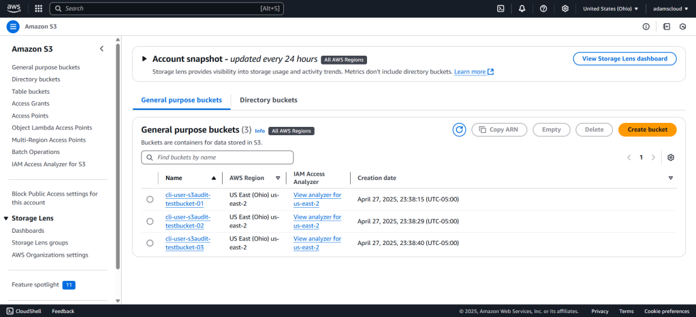
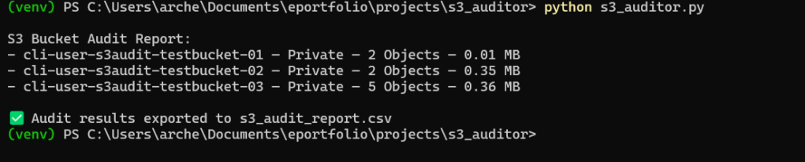
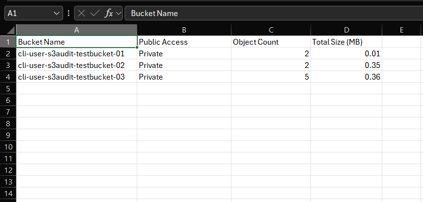

# AWS S3 Auditor – Cloud Storage Visibility & Access Assessment Tool

This Python-based tool audits AWS S3 buckets to detect overly permissive access configurations, public exposures, and insecure policies. It uses the Boto3 library to query cloud storage metadata and permissions, helping security teams quickly identify risks.

🔍 Use case: Detect public buckets, misconfigured access control lists, and policy issues that could lead to data leaks.


### **Purpose**

The purpose of this project was to develop a Python-based security auditing script to analyze Amazon S3 bucket configurations. This tool detects publicly accessible buckets, counts the number of stored objects, and calculates their total size. I wanted to strengthen my understanding of cloud security misconfigurations—specifically focusing on data exposure risks—and reinforce Python scripting and AWS SDK skills.

### **Tools Used**

- **Python 3.12** — Primary scripting language

- **Boto3** — AWS SDK for Python

- **PowerShell** — Execution environment

- **AWS CLI** — For bucket creation and testing

- **AWS S3** — Target cloud storage service

- _(Note: Wireshark, Splunk, and Nmap were not used in this specific project)_

### **Step-by-Step Process**

1. **Environment Setup**
    - Created and activated a Python virtual environment in VS Code.
    
    - Installed Boto3 using pip.
    
    - Configured AWS credentials using AWS CLI with IAM user access.

3. **Initial Script: Bucket Enumeration**
    - Built a basic script to list all S3 buckets tied to the authenticated AWS account.

5. **Phase 1: Public Access Detection**
    - Integrated logic to pull each bucket’s ACL.
    
    - Scanned for any grants to "AllUsers" or "AuthenticatedUsers" and flagged public buckets with warnings.

7. **Phase 2: Object Count and Size Analysis**
    - Queried each bucket for object metadata.
    
    - Counted the number of objects and calculated the total storage size in megabytes (MB).

9. **Phase 3: CSV Report Export**
    - Captured results into a structured CSV file: `s3_audit_report.csv`
    
    - Fields included: Bucket Name, Public Access Status, Object Count, and Total Size in MB.

11. **Bucket Testing**
    - Created three unique S3 buckets with different object counts and file types (text files, PDFs, images).
    
    - Ran the script and verified accurate audit output for each.

### **Final Script Version: AWS S3 Auditor Code**

```python
import csv
import boto3
from botocore.exceptions import ClientError

def check_bucket_public_access(bucket_name):
    """Checks if the S3 bucket is publicly accessible."""
    s3 = boto3.client('s3')
    try:
        acl = s3.get_bucket_acl(Bucket=bucket_name)
        for grant in acl['Grants']:
            grantee = grant.get('Grantee', {})
            if grantee.get('URI') in [
                'http://acs.amazonaws.com/groups/global/AllUsers',
                'http://acs.amazonaws.com/groups/global/AuthenticatedUsers'
            ]:
                return "Public (WARNING)"
        return "Private"
    except ClientError as e:
        print(f"Error checking ACL for bucket {bucket_name}: {e}")
        return "Error"

def get_bucket_object_info(bucket_name):
    """Returns object count and total size (MB) for a given bucket."""
    s3 = boto3.client('s3')
    total_size_bytes = 0
    object_count = 0

    try:
        response = s3.list_objects_v2(Bucket=bucket_name)
        contents = response.get('Contents', [])
        object_count = len(contents)
        total_size_bytes = sum(obj['Size'] for obj in contents)
    except ClientError as e:
        print(f"Error getting object info for {bucket_name}: {e}")
    
    total_size_mb = round(total_size_bytes / (1024 * 1024), 2)
    return object_count, total_size_mb

def list_s3_buckets_full_audit():
    """Performs full audit and writes results to CSV."""
    s3 = boto3.client('s3')
    response = s3.list_buckets()
    
    report_data = []

    print("\nS3 Bucket Audit Report:")
    for bucket in response.get('Buckets', []):
        bucket_name = bucket['Name']
        access_status = check_bucket_public_access(bucket_name)
        object_count, total_size_mb = get_bucket_object_info(bucket_name)
        
        print(f"- {bucket_name} — {access_status} — {object_count} Objects — {total_size_mb} MB")
        
        report_data.append({
            'Bucket Name': bucket_name,
            'Public Access': access_status,
            'Object Count': object_count,
            'Total Size (MB)': total_size_mb
        })

    # Write to CSV
    with open('s3_audit_report.csv', 'w', newline='') as csvfile:
        fieldnames = ['Bucket Name', 'Public Access', 'Object Count', 'Total Size (MB)']
        writer = csv.DictWriter(csvfile, fieldnames=fieldnames)
        
        writer.writeheader()
        for row in report_data:
            writer.writerow(row)

    print("\n✅ Audit results exported to s3_audit_report.csv")

if __name__ == "__main__":
    list_s3_buckets_full_audit()

```

### **Screenshots**

_Below are examples of AWS Console Bucket List, the script in action, and the resulting CSV report._

<figure>



<figcaption>

The AWS Console Bucket List.

</figcaption>

</figure>

<figure>



<figcaption>

The script's output.

</figcaption>

</figure>

<figure>



<figcaption>

The audit results' csv report.

</figcaption>

</figure>

**PowerShell Output:**

```
S3 Bucket Audit Report:
- cli-user-s3audit-testbucket-01 — Private — 2 Objects — 0.01 MB
- cli-user-s3audit-testbucket-02 — Private — 2 Objects — 0.35 MB
- cli-user-s3audit-testbucket-03 — Private — 5 Objects — 0.36 MB
```

**CSV Report Output (Partial):**

| Bucket Name | Public Access | Object Count | Total Size (MB) |
| --- | --- | --- | --- |
| cli-user-s3audit-testbucket-01 | Private | 2 | 0.01 |

### **Who, What, When, Where, Why, How**

- **Who**: Developed by Adam Mukdad as part of a cybersecurity portfolio project.

- **What**: A Python-based S3 auditor script designed to identify misconfigured or exposed cloud storage.

- **When**: Built and tested in April 2025.

- **Where**: Executed locally in a virtual environment, scanning AWS-hosted S3 buckets.

- **Why**: To close hands-on skill gaps identified in a cybersecurity assessment and to showcase my ability to automate real-world cloud security audits.

- **How**: By leveraging AWS Boto3 SDK, Python scripting, and a methodical development cycle across three structured phases.

### **Objectives**

- Gain hands-on experience with cloud storage enumeration and access control validation.

- Demonstrate the ability to script, test, and document a security auditing tool.

- Build a project that is practical, relevant to hiring managers, and portfolio-ready.

### **Challenges & Lessons Learned**

- **ACL Limitations**: Relying solely on ACLs does not detect all public exposures. Bucket policies may also expose data.

- **Empty Bucket Handling**: Buckets without objects required handling for null values in object metadata.

- **Consistency in Output**: Formatting and rounding sizes correctly for CSV export added complexity during testing.

### **Outcome & What I Learned**

This project gave me a clear understanding of how public access misconfigurations can be programmatically detected and reported. I learned how to use the AWS SDK to interact with S3 securely, structure audit reports professionally, and simulate attack surface analysis through object enumeration. It also improved my script organization, error handling, and CSV reporting skills.

### **Key Takeaways for a Hiring Manager**

- I can identify and audit misconfigured AWS S3 buckets using custom Python tools.

- I understand core principles of cloud security: access control, data exposure, and storage analysis.

- I take a methodical, phased approach to development, testing, and reporting.

- I build clean, reusable, and interview-ready code that reflects industry-relevant use cases.
