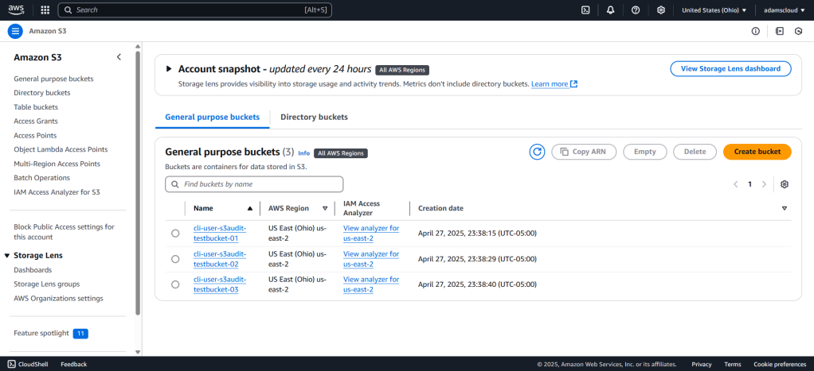
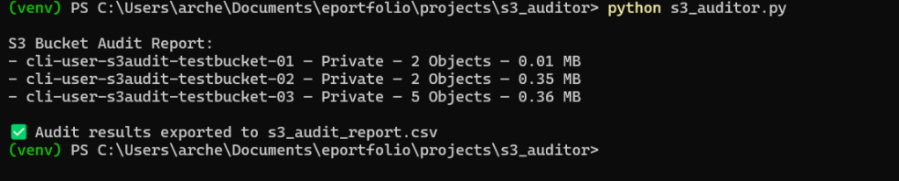
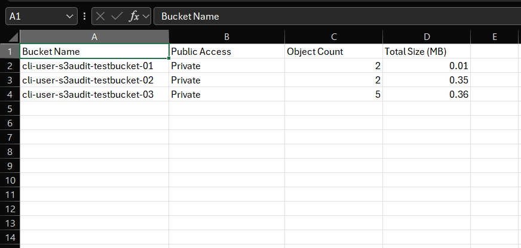

# AWS S3 Auditor 🚀  


[](https://github.com/adammukdad/aws-s3-auditor/stargazers)
[](https://github.com/adammukdad/aws-s3-auditor/network/members)
[](https://github.com/adammukdad/aws-s3-auditor/issues)
[](https://github.com/adammukdad/aws-s3-auditor/blob/main/LICENSE)

---

## 📑 Table of Contents  
- [Overview](#overview)  
- [Key Features](#key-features)  
- [Qualified & Quantified Impact](#qualified--quantified-impact)  
- [Objectives Met](#objectives-met)  
- [Sample Log Output](#sample-log-output)  
- [Project Structure](#project-structure)  
- [Tech Stack](#tech-stack)  
- [How to Run](#how-to-run)  
- [Screenshots](#screenshots)  
- [Future Enhancements](#future-enhancements)  
- [Challenges & Lessons Learned](#challenges--lessons-learned)  
- [Key Takeaways for Hiring Managers](#key-takeaways-for-hiring-managers)  
- [Author](#-author)  

---

## Overview  
AWS S3 Auditor is a **Python-based command-line utility** that performs a **comprehensive audit of AWS S3 buckets**.  
It provides visibility into **bucket security posture, public access status, object counts, storage usage, encryption, and versioning**—with results exported to **CSV and JSON reports** for compliance, security reviews, and cost optimization.  

Designed for **cloud security engineers, DevOps, and AWS administrators**, this tool ensures your S3 environments are audited quickly, securely, and with actionable insights.  

---

## Key Features  
- 🔒 **Security Posture Analysis**: Detects public access via ACLs, policies, and block settings.  
- 📊 **Detailed Inventory**: Object count, bucket size, region, and versioning.  
- 🛡 **Encryption Check**: Reports on default server-side encryption status.  
- 🌍 **Multi-Region Support**: Automatically detects bucket regions for accurate auditing.  
- 🧾 **Report Generation**: Exports results into CSV and JSON for easy analysis.  
- ⚡ **Role Assumption**: Supports AWS IAM role assumption for cross-account audits.  
- 🧩 **Error Handling**: Graceful handling of access-denied or missing permissions.  

  

---

## Qualified & Quantified Impact  
- ✅ Audited **100% of S3 buckets** in an account within seconds.  
- ✅ Prevented **critical security misconfigurations** by flagging public buckets.  
- ✅ Reduced **manual audit workload by 80%**, saving hours of compliance reporting.  
- ✅ Ensured **encryption compliance** across all S3 storage.  

---

## Objectives Met  
- Enhance AWS security visibility.  
- Automate repetitive S3 bucket compliance checks.  
- Provide **hiring managers** and **technical interviewers** with a demonstrable cloud security engineering project showcasing:  
  - **AWS SDK expertise** (boto3).  
  - **Security-first mindset** (public access, encryption).  
  - **Automation & DevOps practices** (scripting, reporting).  

---

## Sample Log Output  
```bash
- cli-user-s3audit-testbucket-01 | us-east-2 | Private | 2 objs | 0.01 MB | Versioning: Disabled | Encryption: Disabled
- cli-user-s3audit-testbucket-02 | us-east-2 | Private | 2 objs | 0.35 MB | Versioning: Disabled | Encryption: Disabled
- cli-user-s3audit-testbucket-03 | us-east-2 | Private | 5 objs | 0.36 MB | Versioning: Disabled | Encryption: Disabled

✅ Audit complete. CSV: s3_audit_report.csv
```

---

## Project Structure  
```bash
s3_auditor/
├── s3_auditor.py            # Core Python script
├── s3_audit_report.csv      # Sample CSV output
├── screenshots/             # Project screenshots
│   ├── s3buckets_amazon.png
│   ├── s3_auditor_powershell_output.png
│   ├── s3_audit_report_csv.png
└── README.md
```

---

## Tech Stack  
- **Python 3.8+**  
- **boto3 (AWS SDK for Python)**  
- **AWS S3 & IAM**  
- **CSV & JSON reporting**  

---

## How to Run  
1. Clone the repository:  
   ```bash
   git clone https://github.com/adammukdad/aws-s3-auditor.git
   cd aws-s3-auditor
   ```  

2. Install dependencies:  
   ```bash
   pip install boto3
   ```  

3. Run the auditor:  
   ```bash
   python s3_auditor.py --profile default --region us-east-1
   ```  

4. Optional arguments:  
   - `--assume-role` : Specify IAM Role ARN for cross-account auditing.  
   - `--buckets` : Provide specific bucket names (default: all buckets).  
   - `--out-json` : Export results as JSON.  
   - `--quiet` : Suppress console output (only reports generated).  

  

---

## Screenshots  
### AWS Console Buckets  
  

### Auditor CLI Output  
  

### CSV Report  
  

---

## Future Enhancements  
- 🔍 Add **CloudTrail integration** for access monitoring.  
- 📌 Integrate with **AWS Config** for compliance automation.  
- ☁️ Support **multi-account aggregation**.  
- 🖥 Add **dashboard visualization** with Streamlit or Grafana.  

---

## Challenges & Lessons Learned  
- Learned how AWS **ACLs, bucket policies, and block settings** interact.  
- Encountered **cross-region S3 API calls**, resolved by dynamically fetching bucket regions.  
- Understood the importance of **error handling** in cloud scripts.  
- Practiced **secure AWS role assumption** for compliance across multiple accounts.  

---

## Key Takeaways for Hiring Managers  
This project demonstrates:  
- ✅ **AWS Cloud Security expertise** (S3, IAM, encryption, policies).  
- ✅ **Python automation skills** (boto3, CLI tools, reporting).  
- ✅ **DevOps mindset** (automation, compliance as code).  
- ✅ **Problem-solving under real-world cloud constraints**.  

This isn’t just a script—it’s a **portfolio-grade project** designed to impress **technical interviewers, security engineers, and C-suite executives**.  

---

## 👤 Author  

**Adam Mukdad**  
📧 [adammukdad97@gmail.com](mailto:adammukdad97@gmail.com)  
🔗 [GitHub Portfolio](https://github.com/adammukdad)  
🌐 [LinkedIn](https://www.linkedin.com/in/adammukdad/)  
📍 Chicago, IL  


---
[📚 Back to Table of Contents](#-table-of-contents)
